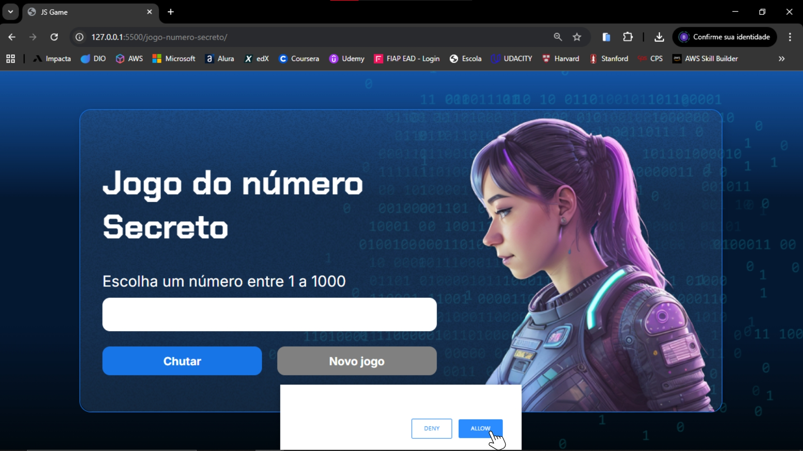
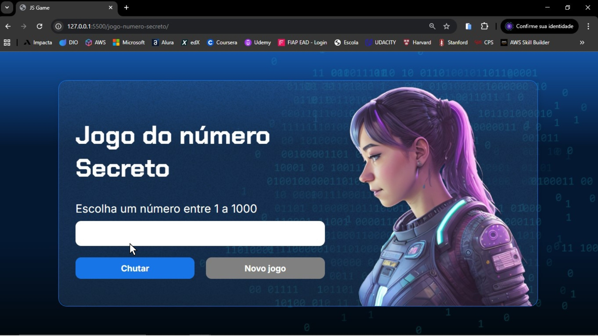
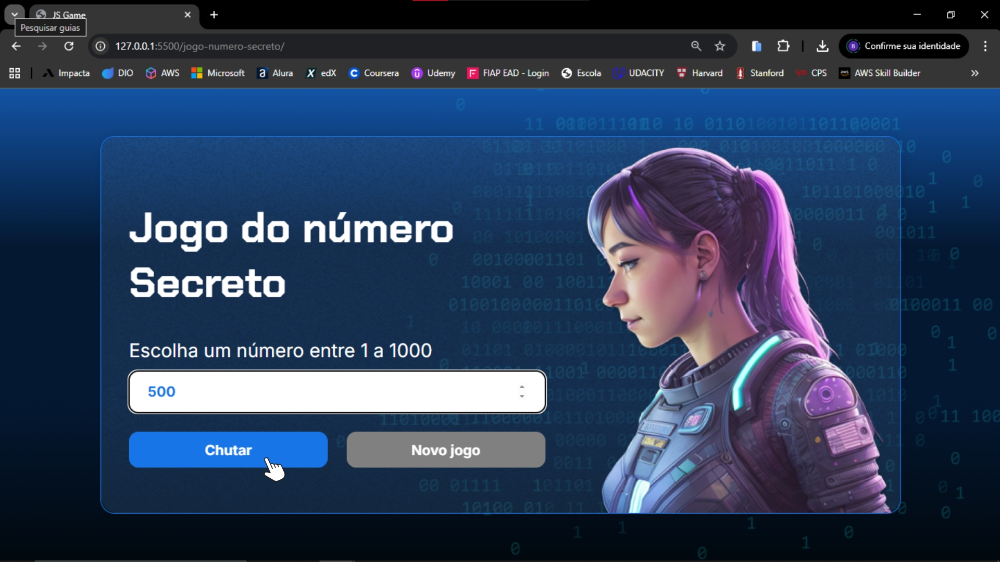
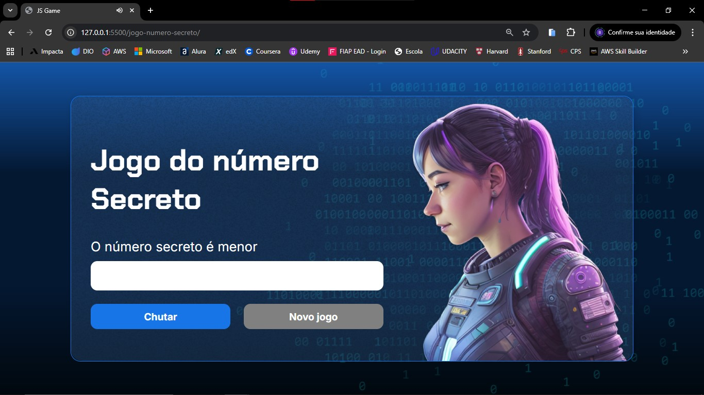
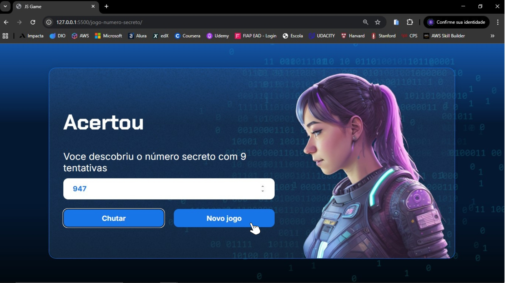

# Jogo do Número Secreto 🎮

Projeto desenvolvido durante o curso de JavaScript da Alura, onde o usuário tenta adivinhar um número secreto dentro de um intervalo definido.

O sistema fornece dicas se o número é maior ou menor e ao acertar, o programa mostra quantas tentativas foram necessárias para acertar.

## 📝 Funcionalidades

- Geração aleatória de um número secreto dentro de um intervalo definido (1 a 1000).
- Sistema de tentativas com contagem do número de palpites realizados.
- Feedback instantâneo indicando se o chute é maior ou menor que o número secreto.
- Mensagem de vitória exibindo o número de tentativas necessárias ao acertar.
- Botão de reinício do jogo para gerar um novo número secreto e resetar as tentativas.
- Leitura em voz alta das mensagens usando responsiveVoice, tornando o jogo mais interativo.

## 💻 Tecnologias Utilizadas

- **HTML5**: Estruturação semântica da página.
- **CSS3**: Estilização moderna e responsiva.
- **JavaScript**: lógica do jogo, geração de números aleatórios e interatividade.
- **ResponsiveVoice.js**: leitura em voz alta das mensagens, proporcionando feedback sonoro ao usuário.

## 🌐 Acesso ao Projeto

[Clique aqui para acessar o projeto no Vercel](https://jogo-js-seven.vercel.app/) 

[Clique aqui para acessar o projeto github.io](https://bianca-bomfim.github.io/jogo-numero-secreto/)

## 💡 Como Rodar o Projeto


### Pré-requisitos

- Ter o [Visual Studio Code (VSCode)](https://code.visualstudio.com/) instalado, caso queira visualizar o código localmente.

### Passos

1. Clone o repositório no terminal:
   ```bash
   git clone https://github.com/bianca-bomfim/jogo-numero-secreto
   ``` 

2. Abra o arquivo index.html no Visual Studio Code e use a extensão "Live Server" para rodar o projeto em um navegador.

    [Instalando e Rodando a Extensão](https://marketplace.visualstudio.com/items?itemName=ritwickdey.LiveServer) 
   

## 👥 Como Usar

1. Ao abrir o jogo, aparece uma mensagem pedindo permissão para usar a voz que lê as instruções em português. Clique em “Allow” para ativar o recurso ou em “Deny” caso não queira utilizar. <br><br>


<br><br>

2. Para começar a jogar digite um número no campo e tente adivinhar o número secreto. <br><br>


<br><br>


3. Digite um número no campo e clique em "Chutar" para verificar se você acertou o número secreto. <br><br>


<br><br>

4. Após chutar um número, o sistema indica se o número secreto é maior ou menor que o valor digitado, ajudando você a se aproximar da resposta correta. <br><br>


<br><br>


<br><br>

5. Quando você acerta o número secreto, o jogo mostra quantas tentativas foram feitas. Clique em "Novo Jogo" para reiniciar e jogar novamente.<br><br>


<br><br>


## 🔢 Agora é a sua vez de jogar! 

Será que você consegue adivinhar o número secreto em poucas tentativas? 
Dê o seu palpite, siga as dicas e desafie sua sorte! 

[Clique aqui para acessar o projeto e começar!](https://jogo-js-seven.vercel.app/)
